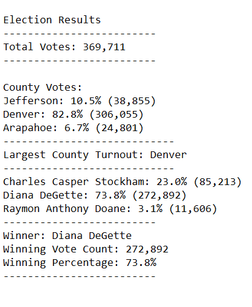
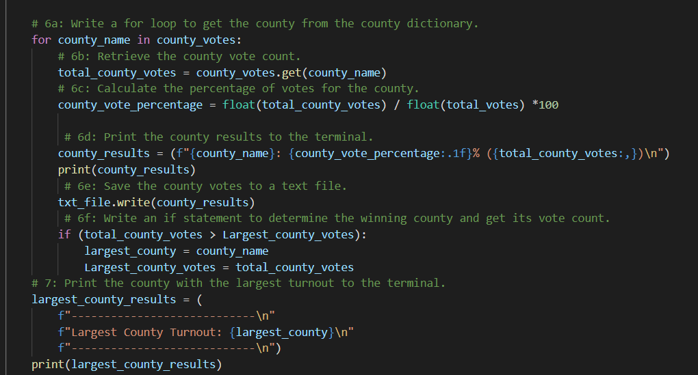

# ElectionAnalysis

## Project Overview
A Colorado Board of Elections employee has given you the following tawsks to complete the election audit of a recent local congressional election.

1. Calculate the total number of votes cast.
2. Get a complete list of counties in which votes were cast.
3. Calculate the total number of votes cast within each county.
4. Calculate the percentage of total votes cast within each county.
5. Determine the county casting the largest number of votes.
6. Get a complete list of candidates who received votes.
7. Calculate the total number of votes each candidate received.
8. Calculate the percentage of votes each candidate won.
9. Determine the winner of the election based on popular vote.

# Summary
The analysis of the election shows:
- There were a total of 369,711 votes cast in the election.
A breakdown of voting by county and by candidate follows.

## County Summary
- The counties voting were:
    - Jefferson County
    - Denver County
    - Arapahoe County
- The county results were:
    - Jefferson County cast 10.5% of the votes with a total of 38,855 votes.
    - Denver County cast 82.8% of the votes with a total of 306,055 votes.
    - Arapahoe County cast 6.7% of the votes with a total of 24,801 votes.
- The county casting the most votes was X, with y votes.

## Candidate Summary
- The candidates were:
    - Charles Casper Stockham
    - Diana DeGette
    - Raymon Anthony Doane
- The candidate results were:
    - Charles Casper Stockham received 23.0% of the vote with 85,213 votes.
    - Diana DeGette received 73.8% of the vote with 272,892 votes.
    - Raymon Anthony Doane received 3.1% of the vote with 11,606 votes.
- The winner of the election was:
    - Diana DeGette, who received 73.8% of the vote with 272,892 votes.

## Audit Program Output
Below is a screenshot of the final text file output by the election audit program.

## Election Audit Summary
Using the program above, designed to summarize votes both by county and by candidate, a variety of further applications are possible. County election commissions may wish to consider voting on a more granular level, such as by voting precinct, or they may wish to consider auditing county vote turnout results across multiple election years. In each instance, the program used here could be easily modified in order to provide comparative summaries of those variables.
The section of code screenshotted below was designed in this instance to consider only the votes collected per county. This section could be duplicated and reformatted in order to consider any of the use cases above.

